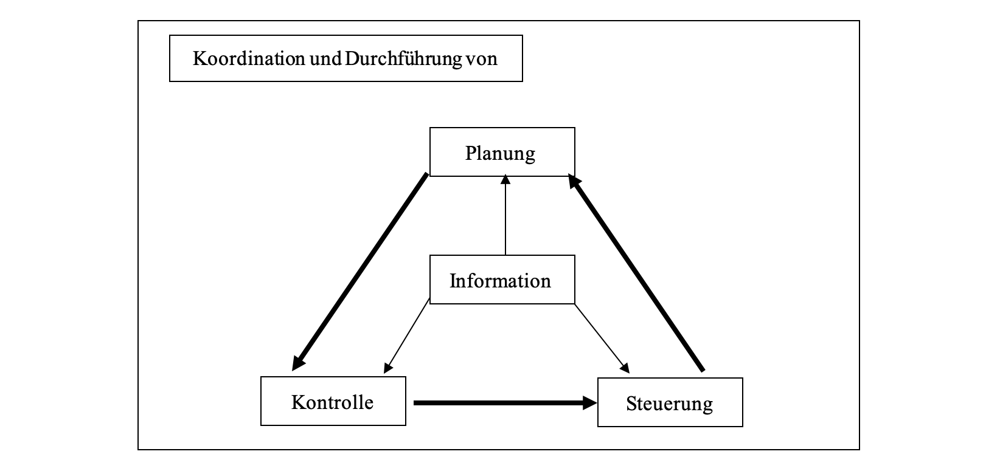

# Brief an Herrn Scheld, Herrn Weber und Herrn Horváth

# Controlling Regelkreis

Herr Prof. Dr. Scheld veröffentlichte 2008 in seinem Buch „Controlling im Mittelstand - Band 1: Grundlagen und Informationsmanagement“ den Ansatz, die Aufgaben des Controllings in Form eines Regelkreises zu beschreiben.

Der Regelkreis besteht aus den vier Grundelementen Information, Planung, Kontrolle und Steuerung. Hinzugefügt wird noch die Koordinationsfunktion, die als Hauptfunktion für die Koordination und Durchführung aller Grundelemente zuständig ist. In den letzten Jahren hat sich die Koordination als die Zentralaufgabe eines Controllers herauskristallisiert, da sie eine Verknüpfung aller Funktionsbereiche bildet. Außerdem unterstützt sie das Unternehmen bei einer effizienten und effektiven Führung (Scheld, 2008, S.6ff).

Die Informationen dienen im Controlling zur Erkenntnisgewinnung im Rahmen der Zielerreichung bzw. Zielerhaltung. Da alle Entscheidungsprozesse auf den vorhandenen Informationen aufbaut, lässt sich sagen, dass Entscheidungen nur so gut sind wie ihre zugrundeliegenden Informationen (Scheld, 2008, S. 8f.).

Die Planung besitzt die Aufgabe zukünftige Entwicklungen von Unternehmensprozessen zu prognostizieren und die vorhandenen Ressourcen optimal auszunutzen. Diese Ziele werden im Folgeschritt von der Kontrolle mit Hilfe eines Soll-Ist-Vergleiches analysiert. Die vorliegenden objektiven Kontrollgrößen beschreiben die tatsächliche Situation des Unternehmens. Sie werden mit dem Zielen aus dem Planungsschritt analysiert und bei Abweichungen wird nach der Ursache gesucht. Die Steuerung, als nächster Schritt im Regelkreis, ergreift Maßnahmen gegen die vorliegenden Abweichungen. Damit soll das laufende Unternehmensziel durch viele tägliche Detailentscheidungen erreicht werden (Scheld, 2018, S. 15-28).

# Controlling als Rationalitätssicherung der Führung

Neben den verschiedenen Aufgaben der Führungsunterstützung, die Scheld in einem Regelkreis darstellt, fügt Prof. Dr. Dr. h.c. Weber die Rationalitätssicherung als weitere Aufgabe des Controllings hinzu. Sie dient zur Sicherung der Führungsqualität des Managements und konzentriert sich dazu auf die Effektivität und Effizienz des Unternehmens (Weber, 2016, S. 44ff.).

Um die Aufgabe der Rationalitätssicherung wirksam zu übernehmen muss der verantwortliche Controller folgende Kriterien erfüllen:
• Hohe Kenntnis der Führung
• Hinreichende Distanz zum Management
• Auszureichende Unabhängigkeit zur Führung
Andere Bereiche eines Unternehmens, wie z.B. die Assistenz der Führung, sind nicht in der Lage, alle Kriterien ausreichend zu erfüllen (Weber, 2016, S.46).

Weber geht sogar einen Schritt weiter und definiert das Controlling als Rationalitätssicherung im Kontext dominierender Koordination durch Pläne. Die anderen Aufgabenfelder grenzt er aus. Er begründet es damit, dass die unterstützenden Aufgaben von anderen Unternehmensabteilungen übernommen werden können und somit nicht spezifisch genug für das Controlling sind, z.B. Informieren und Kontrollieren kann das Rechnungswesen übernehmen. Mit dieser Meinung setzt sich Weber klar von Scheld ab (Weber, 2016, S.47f. + Smolenski, 2008, S.41f).

# Koordinationsbasierte Controllingkonzept

Prof. Dr. Dr. h.c. mult. Horváth sieht die Koordination als zentrale Aufgabe des Controllings. Definieren tut er die Koordination als das Abstimmen einzelner Entscheidungen auf ein gemeinsames Ziel hin. Er sieht das Controllingsystem als Bindeglied zwischen dem Planungs- und Kontrollsystem und dem Informationsversorgungssystem. Diese Systeme sind als getrennte Funktionen zu sehen. Die Hauptaufgabe des Controlling ist es, systembildend und systemkoppelnd zu wirken in dem es eine zielorientierte Koordination erzeugt. Mit dieser Funktion besitzt das Controlling eine der wichtigsten unternehmerischen Aufgabe, da er die notwendige Verbindung zwischen Wissen und Wirken vorzubereiten hat (Horváth, 2015, S.55f.).

Wie oben schon kurz angerissen, ist der systemorientierter Koordinationsbegriff von Horváth zwei geteilt, in die systembildende Koordination und die systemkoppelnde Koordination. Durch diesen Systemansatz wird die Tätigkeit des Koordinieren betont.

Bei der systembildenden Koordination werden, wie der Name schon sagt, Systeme gebildet und aufeinander abgestimmt. So wird eine Gebilde- und Prozessstruktur erzeugt, die die verschiedenen Aufgaben aufeinander abstimmt. Ein großer Vorteil dadurch ist es, dass bei künftigen plötzlichen Entwicklungen Störungen minimiert werden können.

Unter der systemkoppelnden Koordination versteht man den Zusammenhang aller Koordinationsaktivitäten die zur Problemlösung bzw. Reaktion auf Störungen gesehen werden. Dazu gehört die ständige Anpassung der Informationsverbindungen zwischen den Teilsystemen als großer Teil dieses Bereiches.

Bei beiden Arten der Koordination können die Aufgaben funktional und institutional differenziert werden. Funktional bedeutet, dass Funktionsbereiche mit deren Aufgaben zuerst klar voneinander getrennt werden. Diese Subsysteme können dann sinngemäß miteinander verknüpft werden. Bei der institutionellen Sichtweise werden Subsysteme nach Personen oder Sachmitteln konkret zugeordnet und verknüpft (Horváth, 2015, S.46f.).

# FAZIT

Zusammenfassend ist klar zu erkennen, dass die drei Konzepte sich auf verschiedene Aspekte spezialisieren. Trotzdem haben sie eine Schnittmenge durch die Aufgaben Informieren, Planen, Kontrollieren, Steuern und Koordinieren. Sie sind in allen Konzepten in verschiedener Position wiederzufinden.

Scheld unterstreicht durch seinen Ansatz die Reihenfolge und Wiederkehr der Aufgaben „Information“, „Planung“, „Kontrolle“, „Steuerung“ und „Koordination“.
Bei dem Konzept von Weber steht die Rationalitätssicherung der Führung im Vordergrund. Die Aufgaben des Informierens, des Planens, des Kontrollierens und des Steuerns könnten, seiner Auffassung nach, andere Unternehmensbereiche übernehmen und sind somit nicht herausstehend für das Controlling.
Horváth konzentriert sich bei seinem Konzept auf die Koordination. Er sieht die Koordination als Bindeglied zwischen dem Informationssystem und dem Planungs- und Kontrollsystem.

Es sollte also möglich sein, aus diesen Konzepten einen allgemeingültigen Ansatz zu entwickeln, da sie Verknüpfungspunkte besitzen.

# Literatur

[Scheld, G. A. (2008). Controlling im Mittelstand - Band 1: Grundlagen und Informationsmanagement (4. Aufl., Bd. 1). Büren: Gertrud Scheld Fachbibliothek Verlag.](https://biblio.cbs.de/detail.aspx?data=Y21kPTEmYW1wO3NDPWNfMD0wJSVtXzA9MSUlZl8wPTIlJW9fMD04JSV2XzA9c2NoZWxkJmFtcDtDYXRhbG9ndWVJZD0xNDI2NCZhbXA7cGFnZUlkPTImYW1wO1NyYz0yJmFtcDtwUz0xMCZhbXA7U29ydD1FcnNjaGVpbnVuZ3NqYWhy-BKKzaywaiXs=) [ISBN: 978-3503174652](https://www.amazon.de/Controlling-Mittelstand-Band-Grundlagen-Informationsmanagement/dp/3503174656/ref=sr_1_4?__mk_de_DE=ÅMÅŽÕÑ&keywords=controlling+im+mittelstand+scheld&qid=1572723735&sr=8-4)

[Horváth, P., Gleich, R., & Seiter, M. (2015). Controlling (13. Aufl.). München: Franz Vahlen Verlag.](https://biblio.cbs.de/detail.aspx?data=U29ydD1FcnNjaGVpbnVuZ3NqYWhyJmFtcDtzQz1jXzA9MSUlbV8wPTElJWZfMD0yJSVvXzA9OCUldl8wPWNvbnRyb2xsaW5nIGhvcnZhdGgmYW1wO2NtZD0xJmFtcDtDYXRhbG9ndWVJZD0yODg4MCZhbXA7cGFnZUlkPTImYW1wO1NyYz0yJmFtcDtwUz0xMA==-PfywiG/wpwQ=) [ISBN: 978-3800649549](https://www.amazon.de/Controlling-Péter-Horváth/dp/3800649543/ref=sr_1_4?__mk_de_DE=ÅMÅŽÕÑ&crid=1YMKX6BO456BR&keywords=controlling+horvath&qid=1572723878&sprefix=controlling+h%2Caps%2C164&sr=8-4)

[Weber, J., & Schäffer, U. (2016). Einführung in das Controlling (15. Aufl.). Stuttgart: Schäffer-Poeschel Verlag.](https://biblio.cbs.de/detail.aspx?data=U29ydD1FcnNjaGVpbnVuZ3NqYWhyJmFtcDtzQz1jXzA9MSUlbV8wPTElJWZfMD0yJSVvXzA9OCUldl8wPUNvbnRyb2xsaW5nIHdFYmVyJmFtcDtjbWQ9MSZhbXA7Q2F0YWxvZ3VlSWQ9MjcyOTMmYW1wO3BhZ2VJZD0yJmFtcDtTcmM9MiZhbXA7cFM9MTA=-CxTN8L4bM7g=) [ISBN:  978-3791035741](https://www.amazon.de/Einführung-das-Controlling-Jürgen-Weber/dp/3791035746/ref=sr_1_3?__mk_de_DE=ÅMÅŽÕÑ&keywords=controlling+weber&qid=1572723987&sr=8-3)

[Smolenski, F. (2008). Controlling in internationalen Unternehmen (1. Aufl.). Bremen: Salzwasser Verlag.](https://biblio.cbs.de/detail.aspx?data=U29ydD1FcnNjaGVpbnVuZ3NqYWhyJmFtcDtzQz1jXzA9MSUlbV8wPTElJWZfMD0yJSVvXzA9OCUldl8wPWNvbnRyb2xsaW5nIGluIGludGVybmF0aW9uYWxlbiB1bnRlcm5laG1lbiZhbXA7Y21kPTEmYW1wO0NhdGFsb2d1ZUlkPTIwMTk3JmFtcDtwYWdlSWQ9MiZhbXA7U3JjPTImYW1wO3BTPTEw-3GvjmaHEG8M=) [ISBN: 978-3867410885](https://www.econbiz.de/Record/controlling-in-internationalen-unternehmen-smolenski-franziska/10003712344)

